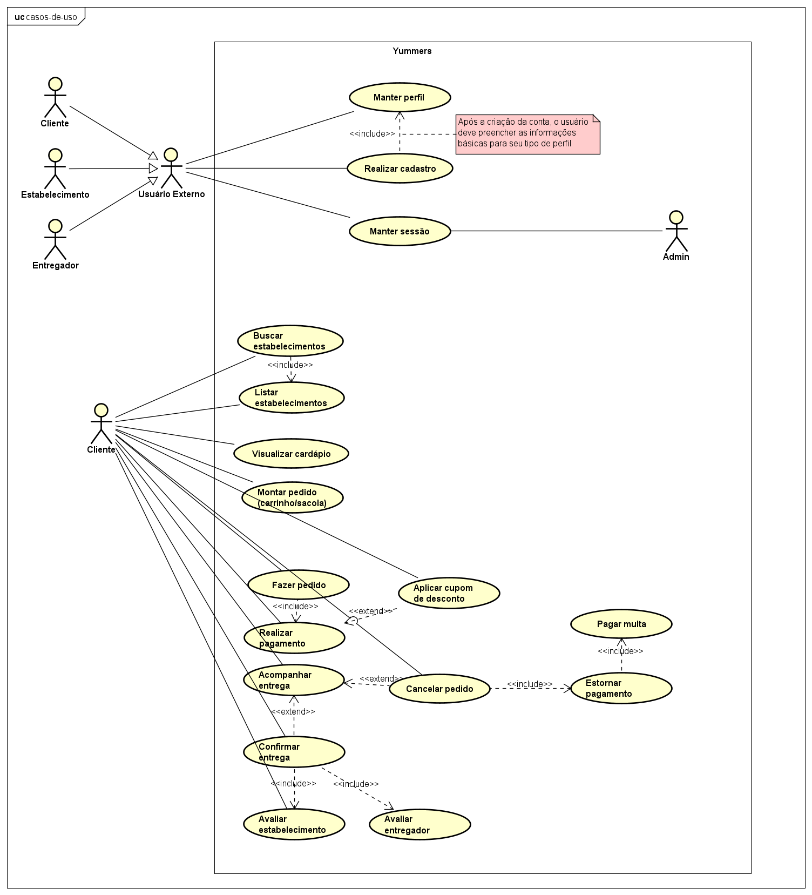

# `Yummers` - Aplicativo de delivery

### Conteúdo da página:

> [4.1 Casos de uso](#41-casos-de-uso) 
> [4.2 Diagrama de casos de uso](#42-diagrama-de-casos-de-uso) 
> [4.3 Fluxo geral de interação](#43-fluxo-geral-de-interação) 

---

## 🔀 4. Visão geral da arquitetura e fluxo de uso

### 4.1 Casos de uso
Nesta seção, são apresentados os principais casos de uso que compõem o sistema. Eles descrevem, sob a perspectiva de cada tipo de usuário, as funcionalidades disponíveis na plataforma e os objetivos associados a cada interação. Os casos estão organizados de acordo com os atores envolvidos: cliente, entregador, estabelecimento e administrador; e classificados conforme sua prioridade utilizando o método MoSCoW.

| **ID** | **Ator** | **Título** | **Descrição** | **Prioridade MoSCoW** |
| --- | --- | --- | --- | --- |
| `US-001` | Usuário Externo | Realizar cadastro | Como usuário externo, quero registrar meus dados de identificação, para obter credenciais de acesso à plataforma. | Must |
| `US-002` | Usuário Externo | Manter perfil | Como usuário externo, quero gerenciar minhas informações pessoais e preferências, para manter meu cadastro atualizado. | Must |
| `US-003` | Usuário Externo | Manter sessão | Como usuário externo, quero autenticar e manter minha conexão segura, para utilizar o sistema sem precisar reinserir credenciais a todo momento. | Must |
| `US-004` | Usuário Externo | Abrir chamado de suporte | Como usuário externo, quero registrar ocorrências e adversidades, para solicitar mediação ou resolução de problemas junto à administração. | Must |
| `US-005` | Admin | Manter sessão | Como administrador, quero autenticar minhas credenciais privilegiadas, para acessar o painel de governança de forma segura. | Must |
| `US-006` | Admin | Gerenciar usuários | Como administrador, quero suspender, reativar ou auditar contas, para manter a integridade e a segurança da comunidade na plataforma. | Must |
| `US-007` | Admin | Aprovar cadastro de estabelecimento | Como administrador, quero avaliar os documentos de novos parceiros comerciais, para liberar ou rejeitar a operação deles no sistema. | Must |
| `US-008` | Admin | Aprovar cadastro de entregador | Como administrador, quero avaliar os documentos e antecedentes de novos entregadores, para autorizá-los a receber solicitações de entrega. | Must |
| `US-009` | Admin | Monitorar pedidos | Como administrador, quero visualizar o status global de todas as transações, para identificar gargalos sistêmicos ou suspeitas de fraude. | Should |
| `US-010` | Admin | Gerenciar chamados de suporte | Como administrador, quero analisar e responder às solicitações abertas, para arbitrar disputas e aplicar resoluções manuais (ex: estornos). | Must |
| `US-011` | Cliente | Buscar estabelecimentos | Como cliente, quero pesquisar opções gastronômicas utilizando parâmetros específicos, para encontrar o que desejo consumir. | Must |
| `US-012` | Cliente | Listar estabelecimentos | Como cliente, quero visualizar um conjunto de estabelecimentos disponíveis, para escolher onde realizarei meu pedido. | Must |
| `US-013` | Cliente | Visualizar cardápio | Como cliente, quero consultar os itens, descrições e preços oferecidos por um parceiro, para decidir o que incluir no meu pedido. | Must |
| `US-014` | Cliente | Montar pedido | Como cliente, quero agrupar itens e definir quantidades, para consolidar minha intenção de compra. | Must |
| `US-015` | Cliente | Fazer pedido | Como cliente, quero enviar minha seleção de itens para processamento, para iniciar o fluxo de compra e preparação. | Must |
| `US-016` | Cliente | Realizar pagamento | Como cliente, quero transferir o valor do pedido para a custódia do sistema, para confirmar a transação e autorizar o preparo. | Must |
| `US-017` | Cliente | Aplicar cupom de desconto | Como cliente, quero inserir um código promocional, para obter redução no valor final da minha transação. | Could |
| `US-018` | Cliente | Acompanhar entrega | Como cliente, quero monitorar as mudanças de estado do meu pedido e a localização do entregador, para prever o momento do recebimento. | Should |
| `US-019` | Cliente | Cancelar pedido | Como cliente, quero abortar uma solicitação em andamento, para desistir da compra conforme as regras de negócio vigentes. | Must |
| `US-020` | Cliente | Pagar multa | Como cliente, quero que o valor penal correspondente seja deduzido do meu saldo retido, para compensar o estabelecimento por um cancelamento tardio. | Must |
| `US-021` | Cliente | Estornar pagamento | Como cliente, quero receber o reembolso do valor retido (integral ou parcial), para recuperar meu saldo após um cancelamento. | Must |
| `US-022` | Cliente | Confirmar entrega | Como cliente, quero fornecer minha chave de segurança ao entregador, para atestar o recebimento físico e liberar o repasse financeiro dele. | Must |
| `US-023` | Cliente | Avaliar estabelecimento | Como cliente, quero registrar uma nota sobre a qualidade do produto, para cumprir o requisito obrigatório de encerramento do pedido. | Must |
| `US-024` | Cliente | Avaliar entregador | Como cliente, quero registrar uma nota sobre o serviço de transporte, para cumprir o requisito obrigatório de encerramento do pedido. | Must |
| `US-025` | Cliente | Visualizar histórico | Como cliente, quero consultar o registro de todas as minhas transações passadas, para acompanhamento pessoal. | Should |
| `US-026` | Entregador | Gerenciar crédito de caução | Como entregador, quero alocar ou retirar fundos do meu saldo de garantia, para estar apto a aceitar rotas de entrega no sistema. | Must |
| `US-027` | Entregador | Alterar disponibilidade | Como entregador, quero alternar meu status de atividade, para sinalizar ao sistema se estou apto a receber novas rotas. | Must |
| `US-028` | Entregador | Listar solicitações de entrega | Como entregador, quero visualizar as ofertas de rotas compatíveis com minha localização, para escolher quais corridas realizar. | Must |
| `US-029` | Entregador | Aceitar solicitação de entrega | Como entregador, quero confirmar a atribuição de uma rota, para assumir a responsabilidade de buscar e levar o pedido. | Must |
| `US-030` | Entregador | Atualizar localização | Como entregador, quero transmitir minhas coordenadas geográficas sequenciais, para permitir o rastreio da entrega pelo cliente e pelo sistema. | Should |
| `US-031` | Entregador | Confirmar retirada do produto | Como entregador, quero validar a chave de segurança gerada pelo estabelecimento, para atestar que coletei a sacola correta e liberar o repasse financeiro do restaurante. | Must |
| `US-032` | Entregador | Confirmar entrega ao cliente | Como entregador, quero validar a chave de segurança fornecida pelo cliente, para atestar a conclusão da rota e liberar meu repasse e caução. | Must |
| `US-033` | Estabelecimento | Gerenciar cardápio | Como estabelecimento, quero incluir, editar, inativar ou excluir itens e preços, para manter minha oferta atualizada para os clientes. | Must |
| `US-034` | Estabelecimento | Gerenciar cupons de desconto | Como estabelecimento, quero criar, editar ou desativar códigos promocionais atrelados à minha loja, para atrair clientes e impulsionar vendas. | Could |
| `US-035` | Estabelecimento | Gerenciar política de multas | Como estabelecimento, quero definir percentuais de retenção baseados nos estágios de preparo, para proteger minha operação contra cancelamentos indevidos. | Must |
| `US-036` | Estabelecimento | Listar pedidos | Como estabelecimento, quero visualizar as demandas recebidas (com pagamento já retido), para organizar a fila de produção. | Must |
| `US-037` | Estabelecimento | Receber pedido | Como estabelecimento, quero aceitar uma nova solicitação validada, para dar início ao processo de preparo. | Must |
| `US-038` | Estabelecimento | Atualizar status do pedido | Como estabelecimento, quero registrar o avanço das etapas de produção, para manter o cliente informado sobre o progresso. | Must |
| `US-039` | Estabelecimento | Solicitar entrega | Como estabelecimento, quero notificar o sistema de que o pacote está pronto, para que uma solicitação de rota seja enviada aos entregadores disponíveis. | Must |
| `US-040` | Estabelecimento | Cancelar pedido | Como estabelecimento, quero abortar uma solicitação por impossibilidade de atendimento, para engatilhar automaticamente o estorno integral ao cliente. | Must |
| `US-041` | Estabelecimento | Finalizar pedido | Como estabelecimento, quero encerrar manualmente o ciclo do pedido após a coleta, para fins de controle interno da minha operação. | Should |
| `US-042` | Estabelecimento | Visualizar histórico | Como estabelecimento, quero auditar todas as transações processadas e repasses liberados, para controle de faturamento e gestão contábil. | Should |

### 4.2 Diagrama de casos de uso
Abaixo é apresentado o diagrama de casos de uso, reunindo os principais atores e suas respectivas interações. O diagrama permite visualizar de forma geral como cada ator se relaciona com as funcionalidades disponíveis.

### 4.3 Fluxo geral de interação
A partir dos casos de uso apresentados anteriormente, esta seção apresenta uma visão geral de como as principais funcionalidades se conectam durante a realização de um pedido. O fluxo acompanha a jornada desde a escolha dos produtos e o pagamento até o preparo, a coleta, a entrega e o encerramento da transação, destacando também os momentos em que a plataforma realiza a custódia e a liberação dos valores. Dessa forma, o diagrama permite visualizar a interação entre cliente, estabelecimento, entregador e sistema ao longo de todo o ciclo do pedido.

```mermaid
flowchart TD

    %% ===================== NÓS DE INÍCIO E FIM =====================
    INICIO(["🏁 Início<br/>Cliente abre o app e faz login"])
    FIM(["✅ Fim<br/>Pedido concluído e saldos liberados"])

    %% ===================== 1. CLIENTE - ESCOLHA E PAGAMENTO =====================
    subgraph Fluxo_do_Cliente ["👤 1 · Escolha e Pagamento"]
        direction TB
        C1["🔍 Busca estabelecimentos e cardápios"]
        C2["🛒 Monta o pedido no carrinho"]
        C3["💳 Realiza o pagamento"]
        C1 --> C2 --> C3
    end

    %% ===================== 2. CUSTÓDIA INICIAL =====================
    subgraph Fluxo_da_Plataforma_1 ["⚙️ 2 · Custódia Inicial"]
        direction TB
        S1{{"🔒 Sistema retém valor total<br/>em escrow"}}
    end

    %% ===================== 3-4. PREPARO, DESPACHO E COLETA (BLOCO ÚNICO) =====================
    subgraph Fluxo_Preparo_Coleta ["🏪🛵 3 · Preparo, Despacho e Coleta"]
        direction TB
        E1["📩 Recebe notificação de pedido pago"]
        E2["📝 Aceita o pedido e inicia preparo"]
        E3["🍳 Conclui preparo · status: Pronto"]
        E4["📞 Solicita entregador"]
        D1["✅ Entregador aceita a solicitação"]
        D2["📍 Entregador desloca-se até o restaurante"]
        E5["🔑 Estabelecimento gera/exibe Chave de Coleta"]
        D3["📷 Entregador escaneia a Chave de Coleta e paga a Caução"]
        E1 --> E2 --> E3 --> E4
        E4 --> D1 --> D2
        E4 --> E5
        D2 --> D3
        E5 --> D3
    end

    %% ===================== 5. LIBERAÇÃO DO LOJISTA =====================
    subgraph Fluxo_da_Plataforma_2 ["⚙️ 4 · Liberação do Repasse · Etapa 1"]
        direction TB
        S2{{"🔓 Sistema valida a chave e<br/>libera repasse do Estabelecimento"}}
    end

    %% ===================== 6. ENTREGA AO CLIENTE =====================
    subgraph Fluxo_do_Entregador_2 ["🛵 5 · Entrega no Endereço"]
        direction TB
        D4["📍 Desloca-se até o endereço do cliente"]
        C4["🔑 Cliente exibe Chave de Entrega"]
        D5["📷 Escaneia a Chave de Entrega"]
        D4 --> C4 --> D5
    end

    %% ===================== 7. LIBERAÇÃO DO ENTREGADOR =====================
    subgraph Fluxo_da_Plataforma_3 ["⚙️ 6 · Liberação do Repasse · Etapa 2"]
        direction TB
        S3{{"🔓 Sistema valida a chave e<br/>libera repasse/caução do Entregador"}}
    end

    %% ===================== 8. ENCERRAMENTO =====================
    subgraph Fluxo_de_Encerramento ["⭐ 7 · Avaliações Obrigatórias"]
        direction TB
        C5["⭐ Cliente avalia o Estabelecimento"]
        C6["⭐ Cliente avalia o Entregador"]
        C5 --> C6
    end

    %% ===================== RELACIONAMENTOS PRINCIPAIS =====================
    INICIO --> C1
    C3 ==>|"Transferência efetivada"| S1
    S1 ==>|"Notifica novo pedido"| E1
    D3 ==>|"Envia validação"| S2
    S2 ==>|"Atualiza status para 'A Caminho'"| D4
    D4 -.->|"Cliente acompanha no app"| C4
    D5 ==>|"Envia validação"| S3
    S3 ==>|"Desbloqueia tela final no app"| C5
    C6 --> FIM

    %% ===================== ESTILIZAÇÃO DOS NÓS =====================
    classDef inicioFim fill:#2c3e50,stroke:#1a252f,stroke-width:2px,color:#fff,font-weight:bold;
    classDef cliente fill:#eaf2fb,stroke:#2874a6,stroke-width:2px,color:#1b4f72,font-weight:600;
    classDef sistema fill:#fef9e7,stroke:#d4ac0d,stroke-width:2px,color:#7d6608,font-weight:600;
    classDef loja fill:#eafaf1,stroke:#239b56,stroke-width:2px,color:#186a3b,font-weight:600;
    classDef entregador fill:#fdedec,stroke:#b03a2e,stroke-width:2px,color:#7b241c,font-weight:600;

    class INICIO,FIM inicioFim;
    class C1,C2,C3,C4,C5,C6 cliente;
    class S1,S2,S3 sistema;
    class E1,E2,E3,E4,E5 loja;
    class D1,D2,D3,D4,D5 entregador;

    %% ===================== ESTILIZAÇÃO DOS SUBGRAPHS =====================
    style Fluxo_do_Cliente fill:#f4f9fd,stroke:#2874a6,stroke-width:1.5px,color:#1b4f72
    style Fluxo_da_Plataforma_1 fill:#fefbf0,stroke:#d4ac0d,stroke-width:1.5px,color:#7d6608
    style Fluxo_Preparo_Coleta fill:#f2fbf6,stroke:#239b56,stroke-width:1.5px,color:#186a3b
    style Fluxo_da_Plataforma_2 fill:#fefbf0,stroke:#d4ac0d,stroke-width:1.5px,color:#7d6608
    style Fluxo_do_Entregador_2 fill:#fef5f4,stroke:#b03a2e,stroke-width:1.5px,color:#7b241c
    style Fluxo_da_Plataforma_3 fill:#fefbf0,stroke:#d4ac0d,stroke-width:1.5px,color:#7d6608
    style Fluxo_de_Encerramento fill:#f4f9fd,stroke:#2874a6,stroke-width:1.5px,color:#1b4f72
```

---

<table width="100%">
<tr>
<td align="left">

[⬅️ Página anterior](3%20-%20Usuários,%20ativos%20e%20pontos%20de%20interação.md)

</td>

<td align="center">

2️⃣

</td>

<td align="right">

[Próxima página ➡️](5%20-%20Modelagem%20de%20ameaças%20com%20STRIDE.md)

</td>
</tr>
</table>

### **Índice**:

**Etapa 1**:

1. [**🆔 Identificação do sistema**](../../README.md)
2. [**📝 Descrição do sistema**](../../README.md)
3. [**👥 Usuários, ativos e pontos de interação**](3%20-%20Usuários,%20ativos%20e%20pontos%20de%20interação.md)
4. [**🔀 Visão geral da arquitetura e fluxos de uso**](#4-visão-geral-da-arquitetura-e-fluxo-de-uso) 👈
5. [**🎯 Modelagem de ameaças com STRIDE**](5%20-%20Modelagem%20de%20ameaças%20com%20STRIDE.md)
6. [**🚨 Casos de abuso**](6%20-%20Casos%20de%20abuso.md)
7. [**📌 Considerações finais da Etapa 1**](7%20-%20Considerações%20finais%20da%20Etapa%201.md)

**Etapa 2**:

8. [**🛡️ Análise e priorização dos riscos**](../etapa-2/8%20-%20Análise%20e%20priorização%20dos%20riscos.md)
9. [**🧩 Tratamento dos riscos com NIST CSF**](../etapa-2/9%20-%20Tratamento%20dos%20riscos%20com%20NIST%20CSF.md)

**Etapa 3**:

10. [**🏗️ Arquitetura segura**](../etapa-3/10%20-%20Arquitetura%20segura.md)

**Etapa 4**:

11. [**💻 Código seguro e testes de segurança**](../etapa-4/11%20-%20Código%20seguro%20e%20testes%20de%20segurança.md)

**Etapa 5**:

12. [**🔎 Verificação de vulnerabilidades**](../etapa-5/12%20-%20Verificação%20de%20vulnerabilidades.md)

**Etapa 6**:

13. [**📡 Monitoramento e detecção de intrusões**](../../roteiros/etapa-6-deteccao-de-intrusoes.md)

**Etapa 7**:

14. [**🎥 DevSecOps e vídeo final**](../../roteiros/etapa-7-devsecops-e-video-final.md)

---