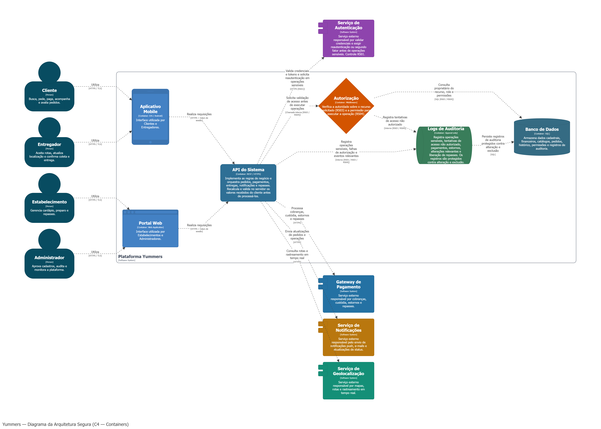
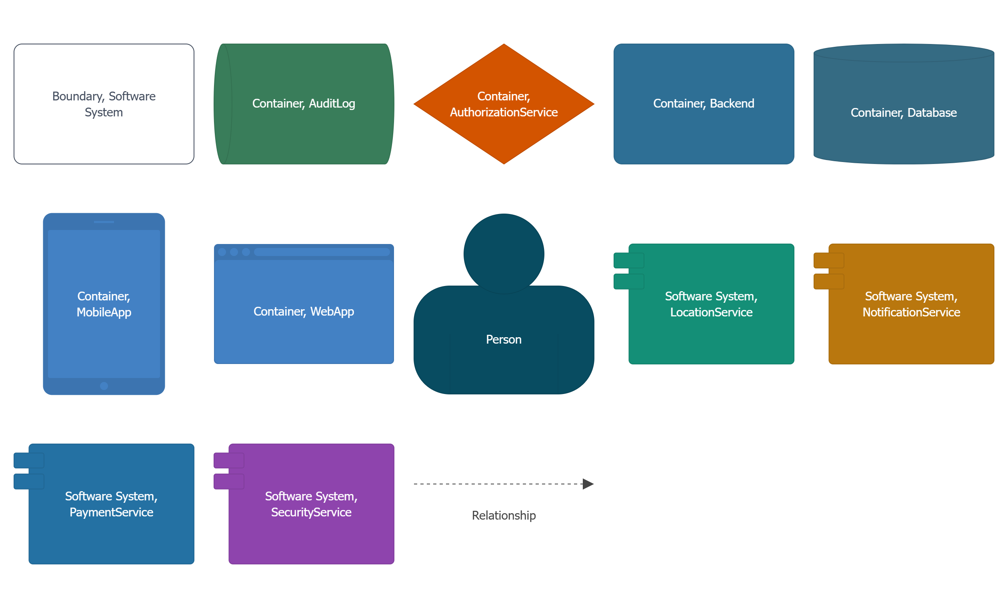

## 18.1 Requisitos de segurança

Esta seção traduz as ameaças e riscos previamente priorizados em requisitos de segurança acionáveis. Cada requisito define uma restrição ou comportamento obrigatório para o sistema, acompanhado de um critério de verificação claro para garantir sua correta implementação e validação durante o ciclo de desenvolvimento

| ID | Risco de origem | Requisito de segurança | Critério de verificação |
|---|---|---|---|
| **RS01** | R01 — Uso indevido da conta de um cliente | O sistema deverá exigir autenticação adicional (reautenticação ou MFA/segundo fator) antes de confirmar operações sensíveis ou financeiras vinculadas à conta do cliente. | A operação deve ser bloqueada e um alerta de segurança registrado em log caso o desafio de autenticação adicional não seja concluído com sucesso. |
| **RS02** | R04 — Manipulação do valor do pedido | O backend deverá recalcular e validar o valor total do pedido de forma autônoma, utilizando a base de preços, taxas e regras de negócio armazenadas no servidor. | A requisição de finalização de pedido deve ser rejeitada (ou os valores sobrescritos pela versão do servidor) se o total enviado pelo frontend divergir do cálculo do backend. |
| **RS03** | R11 — Acesso a informações da conta e pedidos de outro usuário | A API deverá implementar validação de autorização a nível de objeto (BOLA/IDOR), garantindo que o usuário autenticado seja o legítimo proprietário do recurso acessado. | Requisições que manipulem ou consultem IDs de recursos pertencentes a terceiros devem retornar erro de autorização (ex.: `HTTP 403 Forbidden` ou `404 Not Found`) e gerar evento de auditoria. |
| **RS04** | R23 — Acesso não autorizado às funções administrativas | O servidor deverá validar rigorosamente o perfil (role) do usuário antes de conceder acesso a endpoints, funções ou relatórios de nível administrativo. | Tentativas de acesso a endpoints administrativos por contas sem a role correspondente no token/sessão devem ser sumariamente negadas (`HTTP 403 Forbidden`) e monitoradas. |

---

## 18.2 Vulnerabilidades catalogadas

Para fundamentar as estratégias de mitigação, esta seção mapeia os principais riscos identificados a vulnerabilidades e fraquezas de segurança reconhecidas pelo mercado. A utilização de catálogos padronizados, como OWASP e CWE, facilita a compreensão técnica do problema e orienta a equipe na adoção de práticas de desenvolvimento seguro.

| Risco | Vulnerabilidade ou categoria | Referência utilizada | Relação com o sistema |
|---|---|---|---|
| **R01 — Uso indevido da conta de um cliente** | Falha de autenticação e gerenciamento de sessão | CWE-287 (Improper Authentication) / OWASP Top 10 A07:2021 – Identification and Authentication Failures / OWASP ASVS V3 | Permite que um atacante que obtenha o token de sessão ou credenciais de um cliente realize compras com os meios de pagamento salvos, devido à falta de verificação de identidade no momento da transação. |
| **R04 — Manipulação do valor do pedido** | Confiança excessiva em dados controlados pelo cliente (Validação insuficiente) | CWE-602 (Client-Side Enforcement of Server-Side Security) / OWASP Top 10 A08:2021 – Software and Data Integrity Failures | Permite que um usuário mal-intencionado intercepte a requisição de checkout e reduza o valor final a ser pago, explorando a falha do backend em confiar no total calculado pelo frontend. |
| **R11 — Acesso a informações da conta e pedidos de outro usuário** | Quebra de controle de acesso a nível de objeto (BOLA/IDOR) | CWE-639 (Authorization Bypass Through User-Controlled Key) / OWASP Top 10 A01:2021 – Broken Access Control / OWASP API Security Top 10 (API1:2023) | Permite que um usuário legítimo altere o ID do pedido ou da conta na URL/API e consiga visualizar dados pessoais e histórico de compras de outros usuários da plataforma. |
| **R23 — Acesso não autorizado às funções administrativas** | Quebra de controle de acesso a nível de função (Missing Authorization) | CWE-862 (Missing Authorization) / OWASP Top 10 A01:2021 – Broken Access Control / OWASP API Security Top 10 (API5:2023) | Permite que um usuário comum descubra e acesse as rotas administrativas da API para executar ações privilegiadas, pois o sistema oculta os botões no frontend, mas não bloqueia a requisição no backend. |

---

## 18.3 Diagrama da arquitetura segura

Abaixo é apresentada a representação visual da arquitetura segura estruturada para a plataforma. O diagrama `C4 Model` (nível de `Contaneirs`) destaca os principais componentes do sistema, as fronteiras de confiança, os fluxos de dados sensíveis e os pontos exatos onde os controles de segurança estabelecidos são aplicados.

#### Diagrama C4 Model - Containers

#### Legenda

---

## 18.4 Decisões de arquitetura

Estão documentadas as escolhas estratégicas de design de software adotadas para mitigar os riscos catalogados. O registro de cada decisão detalha o problema original, a abordagem escolhida, a justificativa técnica e o resultado esperado, garantindo total rastreabilidade entre a análise de ameaças e a arquitetura final implementada.

| Decisão | Risco(s) tratado(s) | Problema | Decisão tomada | Motivo | Componente afetado | Resultado esperado |
|---|---|---|---|---|---|---|
| **1. Exigir reautenticação em operações sensíveis** | R01 — Uso indevido da conta de um cliente | Um atacante com uma sessão sequestrada ou credenciais vazadas pode realizar pedidos fraudulentos usando os cartões salvos do cliente. | Implementar uma camada de "Step-up Authentication" (reautenticação biométrica, senha ou OTP) para finalizar transações fora do padrão ou alterar dados da conta. | Uma sessão ativa não garante que o operador atual é o titular legítimo. O desafio adicional barra a exploração de sessões sequestradas no momento mais crítico (movimentação financeira). | Serviço de Identidade (IAM) e Módulo de Checkout. | Transações financeiras e alterações cadastrais críticas não são efetivadas sem a prova direta de identidade do titular. |
| **2. Source of Truth (Fonte da Verdade) exclusiva no Servidor** | R04 — Manipulação do valor do pedido | O backend processa o pagamento baseando-se no valor final enviado pelo aplicativo, permitindo adulterações via proxy. | O servidor deve reconstruir o carrinho e recalcular o valor do zero, utilizando estritamente os preços, regras de desconto e taxas armazenados no banco de dados. | O ambiente do cliente (browser/app) não é confiável. Toda regra de precificação executada no frontend deve ser considerada meramente visual e descartada na consolidação. | API de Pedidos e Microsserviço de Pagamentos. | Pedidos com valores manipulados são automaticamente corrigidos ou invalidados antes do envio ao Gateway de Pagamento. |
| **3. Centralização da camada de Autorização (Middleware de Acesso)** | R11 — Acesso a informações da conta e pedidos de outro usuário, R23 — Acesso não autorizado às funções administrativas | Verificações de permissão espalhadas pelo código facilitam o esquecimento de regras em alguns endpoints, permitindo IDOR e elevação de privilégio. | Implementar um *API Gateway* ou *Middleware* centralizado que verifique automaticamente a propriedade do recurso solicitado (BOLA) e as permissões do cargo (RBAC) antes de rotear a requisição. | A validação centralizada elimina o "fator humano" de esquecer de programar a checagem em um endpoint específico. A segurança se torna "by default" para toda nova rota criada. | API Gateway / Middleware de Autorização / Backend central. | Acesso não autorizado a dados de terceiros ou funções administrativas é consistentemente bloqueado com `HTTP 403`, independente do dispositivo cliente. |

---

<table width="100%">
<tr>
<td align="left">

[⬅️ Página anterior](../etapa-2/9%20-%20Tratamento%20dos%20riscos%20com%20NIST%20CSF.md)

</td>

<td align="center">

8️⃣

</td>

<td align="right">

[Próxima página ➡️](../etapa-4/11%20-%20Código%20seguro%20e%20testes%20de%20segurança.md)

</td>
</tr>
</table>

### **Índice**:

**Etapa 1**:

1. [**🆔 Identificação do sistema**](../../README.md)
2. [**📝 Descrição do sistema**](../../README.md)
3. [**👥 Usuários, ativos e pontos de interação**](../etapa-1/3%20-%20Usuários,%20ativos%20e%20pontos%20de%20interação.md)
4. [**🔀 Visão geral da arquitetura e fluxos de uso**](../etapa-1/4%20-%20Visão%20geral%20da%20arquitetura%20e%20fluxos%20de%20uso.md) 
5. [**🎯 Modelagem de ameaças com STRIDE**](../etapa-1/5%20-%20Modelagem%20de%20ameaças%20com%20STRIDE.md)
6. [**🚨 Casos de abuso**](../etapa-1/6%20-%20Casos%20de%20abuso.md)
7. [**📌 Considerações finais da Etapa 1**](../etapa-1/7%20-%20Considerações%20finais%20da%20Etapa%201.md)

**Etapa 2**:

8. [**🛡️ Análise e priorização dos riscos**](../etapa-2/8%20-%20Análise%20e%20priorização%20dos%20riscos.md)
9. [**🧩 Tratamento dos riscos com NIST CSF**](../etapa-2/#9-tratamento-dos-riscos-com-nist-csf)

**Etapa 3**:

10. [**🏗️ Arquitetura segura**](#) 👈

**Etapa 4**:

11. [**💻 Código seguro e testes de segurança**](../etapa-4/11%20-%20Código%20seguro%20e%20testes%20de%20segurança.md)

**Etapa 5**:

12. [**🔎 Verificação de vulnerabilidades**](../etapa-5/12%20-%20Verificação%20de%20vulnerabilidades.md)

**Etapa 6**:

13. [**📡 Monitoramento e detecção de intrusões**](../../roteiros/etapa-6-deteccao-de-intrusoes.md)

**Etapa 7**:

14. [**🎥 DevSecOps e vídeo final**](../../roteiros/etapa-7-devsecops-e-video-final.md)

---